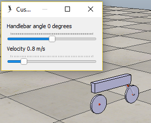

# Bike model

This directory contains a self-stabilizing bike model for [V-REP](http://coppeliarobotics.com/) simulator.

## Introduction

A screenshot of the model can be seen below.

The bike can be controlled by setting the target handlebar angle, and speed can be controlled by setting the target velocity. 
Bike tries to stabilize itself by tuning the handlebar angle. The stability region is quite small but typically works quite well if control inputs are gradual.

## Detailed description

Speed is controlled directly by giving a speed reference to the back wheel motor, which contains an PI controller.

The stabilizing control is very simple. An accelerometer is connected to the bike body and it's x-component (sideways acceleration) is monitored. 
There is a PI controller that tries to keep the x-component of the acceleration in a reference (zero for upright) by turning the handlebar.

To control turning of the bike, a PI controller monitors the actual handlebar angle and tunes the reference for the x-axis acceleration to reach 
the desired handlebar angle.

The handlebar contains a servo with position reference. The target position is given by the acceleration controller.

## Notes

This model has been built and tested with V-REP Pro Edu 3.6.1 with Newton physics engine. Other engines may require 
tuning of controller, mass or inertia parameters.

## License

Copyright (C) 2019 Lauri Peltonen

This program is free software: you can redistribute it and/or modify
it under the terms of the GNU General Public License as published by
the Free Software Foundation, either version 3 of the License, or
(at your option) any later version.

This program is distributed in the hope that it will be useful,
but WITHOUT ANY WARRANTY; without even the implied warranty of
MERCHANTABILITY or FITNESS FOR A PARTICULAR PURPOSE.  See the
GNU General Public License for more details.

You should have received a copy of the GNU General Public License
along with this program.  If not, see <https://www.gnu.org/licenses/>.

