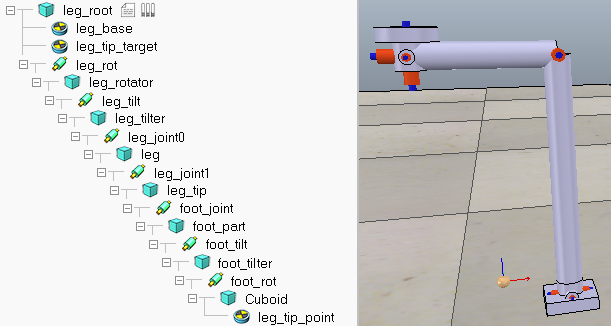

# Biped robotic leg

This is a biped robot leg model for [V-REP](http://coppeliarobotics.com/) simulator. This 
model is intended to be used in humanoid style robots.

## Introduction

A screenshot of the model and the model structure can be seen below.

The model uses "inverse kinematics" to calculate the joint angles. The top level dummy "leg-tip-target" 
(the floating dummy in the figure) is used to mark the target position for the leg. The script of the leg 
calculates leg tilt and joint angles such that it tries to reach the target.

All the joints have a P type controller by default; it can be changed or tuned by hand if/when necessary.

## Detailed description

The calculation is done in the script attached to the leg_root block, which is the root of the model.

The script measures the distances between leg joints 1 and 2 and between joint 2 and leg tip dummy, and uses 
those distances for calculations. As a result, the script does not need to be changed if leg dimensions 
are changed. It should be noted though, that rotation and joint 1 should be coincident, otherwise the 
calculations are not correct. Also the leg_base dummy must be located in the same spot.

The leg can be rotated freely by using sim.setJointTargetPosition on the leg_rot joint. This does not rotate 
the target dummy, but instead the model tries to reach the target regardless of the rotation angle. 

The script first compensates for the rotation angle. Then it calculates the necessary tilt angle from the 
neutral position to the target and applies that.
Then it calculates the joint angles that are needed so that the leg reaches the target point and applies those. 
For this calculation, it is necessary to calculate distances normal and perpendicular to the tilt angle. This 
makes the script a bit more complicated than that of the generic leg model.

The leg also has a foot, which the model tries to keep horizontal. The foot can be rotated freely by using 
sim.setJointTargetPosition on the foot_rot joint.

The angle calculations are done similarly to may tutorials on the internet, for example:
http://www.ryanjuckett.com/programming/analytic-two-bone-ik-in-2d/
https://appliedgo.net/roboticarm/
https://robotacademy.net.au/lesson/inverse-kinematics-for-a-2-joint-robot-arm-using-geometry/

## Notes

In the model the "leg_root" block is static. To be used with a real model it is necessary to change its
properties and make it dynamic.

All the calculations are done in the coordinate frame of the leg itself. This makes it possible to rotate the leg 
freely (by rotating the "leg_root" block) and the calculations still work correctly. However, the foot is kept 
horizontal in the leg's coordinate frame; if the model is rotated about its X or Y axis, the foot is no longer kept 
horizontal in world coordinate frame.

The initial pose of the leg can be set by setting the joint angle in joint properties when the simulation is not running.

The model can be copied freely, and the copies should be named similarly except appending #0, #1 etc to separate the 
instances. This makes all the copies work individually without needing to touch the code.

Only the dummies and joints are referenced in the code (by their names), all other blocks can be renamed freely.

The intention is that the external controller only changes the "leg_tip_target" dummy position to move the leg. 
Via the V-REP api it is possible to do so in any coordinate frame (world, robot, leg...) depending on the application.

This model has been built and tested with V-REP Pro Edu 3.6.1 with Newton physics engine. Other engines may require 
tuning of controller, mass or inertia parameters.

## License

Copyright (C) 2019 Lauri Peltonen

This program is free software: you can redistribute it and/or modify
it under the terms of the GNU General Public License as published by
the Free Software Foundation, either version 3 of the License, or
(at your option) any later version.

This program is distributed in the hope that it will be useful,
but WITHOUT ANY WARRANTY; without even the implied warranty of
MERCHANTABILITY or FITNESS FOR A PARTICULAR PURPOSE.  See the
GNU General Public License for more details.

You should have received a copy of the GNU General Public License
along with this program.  If not, see <https://www.gnu.org/licenses/>.

