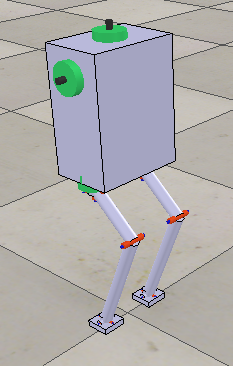

# Biped robot model

This directory contains a simple biped robot for [V-REP](http://coppeliarobotics.com/) simulator.

## Introduction

A screenshot of the model and the model can be seen below.

There are three different versions of the robot included:
1. `biped_robot.ttt` contains an "dummy" version of the robot and is intended to be controlled via external program. An example python script will be added later.
2. `biped_robot_paths.ttt` is a "stand-alone" version in which the target leg positions are pre-calculated with a python script and the path is stored in the model. The path is calculated using my [walking pattern generator](https://github.com/zanppa/WPG) and the code will be added later.
3. `biped_robot_paths_low_inertia.ttt` is same as previous but with smaller (more realistic) inertias on the componenents.

None of the models contain any stabilizing functions and thus the walking is not stable for long. Stabilization could be implemented in the python script but is not done yet.

## Notes

This model has been built and tested with V-REP Pro Edu 3.6.1 with Newton physics engine. Other engines may require 
tuning of controller, mass or inertia parameters.

## License

Copyright (C) 2019 Lauri Peltonen

This program is free software: you can redistribute it and/or modify
it under the terms of the GNU General Public License as published by
the Free Software Foundation, either version 3 of the License, or
(at your option) any later version.

This program is distributed in the hope that it will be useful,
but WITHOUT ANY WARRANTY; without even the implied warranty of
MERCHANTABILITY or FITNESS FOR A PARTICULAR PURPOSE.  See the
GNU General Public License for more details.

You should have received a copy of the GNU General Public License
along with this program.  If not, see <https://www.gnu.org/licenses/>.

